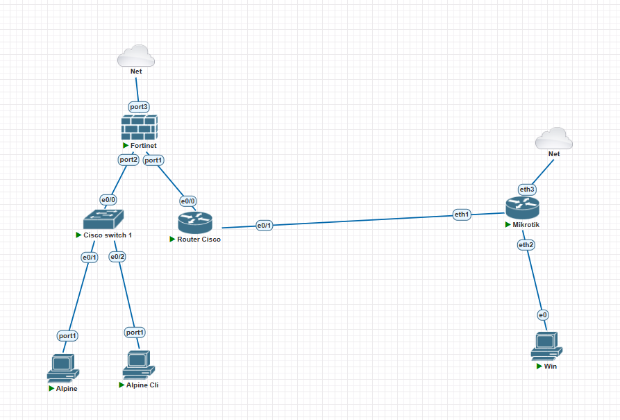

# Proyek 1: Multi-Vendor Hybrid Secure Networking Lab 
### Integrasi Infrastruktur Inti: FortiGate x Router Cisco x MikroTik CHR

## Deskripsi Proyek
Proyek ini menyimulasikan arsitektur interkoneksi komunikasi *Site-to-Site* skala enterprise yang menghubungkan **Kantor Pusat (Headquarter)** dan **Kantor Cabang (Branch)** melewati jaringan penyedia layanan/ISP tiruan. Simulasi ini dirancang menggunakan **PNETLab** untuk menguji interoperabilitas, pembatasan lisensi kriptografi, dan solusi taktis pemulihan jaringan (*business continuity*) pada perangkat keamanan modern.

---

## 1. Topologi Jaringan & Alokasi Interface
Infrastruktur lab ini dibangun menggunakan kombinasi tiga vendor utama:
*   **Headquarter Boundary (Pusat):** Fortinet FortiGate VM64 (FortiOS v6.4)
*   **Branch Boundary (Cabang):** MikroTik Cloud Hosted Router (RouterOS v7)
*   **Core Provider Link (ISP):** Cisco IOL L3 (Simulasi Awan Provider)

### • Dokumentasi Topologi Jaringan
Berikut adalah rancangan topologi interkoneksi multi-vendor yang diimplementasikan:


### • Hasil Verifikasi Pengalamatan IP Perangkat
Berikut adalah bukti validasi konfigurasi *IP Address* dan *Interface* yang telah aktif pada masing-masing sisi:
*   **Sisi MikroTik (Branch):** Konfigurasi via Winbox.
    
*   **Sisi FortiGate (HQ):** Konfigurasi via Web GUI dashboard.
    

---

## 2. Investigasi Masalah: Kegagalan Otentikasi IPsec VPN
Pada rencana awal, interkoneksi antar-site akan diamankan menggunakan IPsec VPN Tunnel. Namun, ditemukan kendala kegagalan *handshake* saat proses implementasi.

### • Analisis Akar Masalah (Root Cause Analysis)
1.  **Restriksi Lisensi FortiGate:** Node FortiGate VM yang digunakan berjalan pada model *Trial non-LENC (Low Encryption)* akibat regulasi lisensi ekspor kriptografi. Hal ini mengunci mati (*hard-locked*) proposal Phase 1 hanya pada algoritma enkripsi **DES** yang sudah usang.
2.  **Deprekasi Kernel MikroTik:** Perangkat Kantor Cabang menggunakan MikroTik RouterOS v7. Pada versi ini, biner enkripsi DES telah dihapus total dari kernel demi standar keamanan modern (*fatal proposal rejection*).
3.  **Dampak Log:** Terjadi ketidakcocokan proposal enkripsi yang memicu log error `"initiator can't find identity for peer"` dan `"secret string is empty"` di sisi MikroTik.

### • Bukti Dokumentasi Masalah
*   **Proposal Terkunci di FortiGate:**
    
*   **Log Kegagalan Otentikasi di Winbox:**
    

---

## 3. Solusi Alternatif: Implementasi GRE Tunneling
Untuk menjaga kelangsungan operasional bisnis (*business continuity*) dan mem-bypass batasan enkripsi perangkat *trial*, arsitektur dialihkan secara taktis menggunakan **GRE (Generic Routing Encapsulation) Tunnel** dengan alokasi IP Point-to-Point `192.168.99.1/30` <-> `192.168.99.2/30` untuk mengalirkan paket data internal langsung melewati jalur *Core Provider*.

### • Dokumentasi Konfigurasi GRE


### • Skrip Konfigurasi Utama (CLI)

**Sisi MikroTik (Kantor Cabang):**
```mikrotik
/interface gre add name=gre-ke-pusat local-address=100.100.100.2 remote-address=200.200.200.2 dscp=inherit
/ip address add address=192.168.99.2/30 interface=gre-ke-pusat
```

**Sisi FortiGate (Kantor Pusat):**
```text
config system gre-tunnel
    edit "gre-ke-cabang"
        set interface "port1"
        set local-gw 200.200.200.2
        set remote-gw 100.100.100.1
    next
end
```

---

## 4. Verifikasi Akhir & Uji Konektivitas (Reachability Test)
Setelah jalur terowongan hibrida multi-vendor dikonfigurasi, dilakukan pengujian ICMP (Ping) dari segmen klien lokal di masing-masing *site* (Linux & Windows Client) untuk memastikan rute data terenkapsulasi dengan sempurna.

### • Hasil Pengujian Klien
Pengujian membuktikan status koneksi sukses penuh (**0% packet loss**) dan jalur data antar-site telah terhubung secara fungsional.

*   **Pengujian via Linux Client:**
    
*   **Pengujian via Windows Client:**
    

---

## 5. Prasyarat Simulator & Spesifikasi Image (Untuk Kebutuhan Replikasi Lab)
Bagi *User* atau *Technical Reviewer* yang ingin mereplikasi, menguji, atau meninjau konfigurasi mentah lab ini, berkas topologi berkstensi `.unl` (**MultiVendor Secure SDWAN Branch Office Tunneling.unl**) telah disediakan di dalam repositori ini. 

Berikut adalah spesifikasi versi *image* (QEMU & IOL) yang digunakan di dalam **PNETLab** agar seluruh konfigurasi script dan interkoneksi interface dapat termuat dengan sempurna:

*   **Fortinet Firewall (HQ):** 
    *   Template: `fortinet` (QEMU)
    *   Nama Folder/Image: `fortinet-FGT-v6-4-build1579`
    *   Alokasi RAM: 1024 MB | CPU: 1 Core
*   **MikroTik Router (Branch):** 
    *   Template: `mikrotik` (QEMU Cloud Hosted Router)
    *   Nama Folder/Image: `mikrotik-7.24.2`
    *   Alokasi RAM: 128 MB | CPU: 1 Core
*   **Router Cisco (Core Provider/ISP):** 
    *   Template: `iol` (Cisco IOS on Linux L3)
    *   Nama File Image: `i86bi-linux-l3-adventerprisek9-m2_157_3_may_2018.bin`
*   **Cisco Switch 1:** 
    *   Template: `i86bi_linux` (Cisco IOS on Linux L2)
    *   Nama File Image: `i86bi_linux-l2-adventerprisek9-ms.bin`
*   **End-User Client (Linux & Windows):**
    *   Linux GUI: `alpine-alpine-desktop-3-20-3` (RAM 1024 MB)
    *   Linux CLI: `alpine-alpine-3-20-3` (RAM 512 MB)
    *   Windows Client: `win-tiny10` (RAM 1024 MB)

---
*Dokumentasi ini disusun sebagai bagian dari portofolio implementasi infrastruktur jaringan dan pemecahan masalah keamanan tingkat entitas.*
