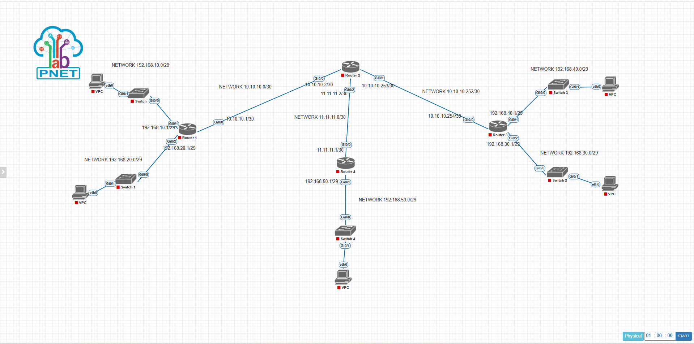

# Proyek 2: Multi-Protocol Dynamic Route Redistribution Lab
### Integrasi Heterogen Lintas Domain: Cisco EIGRP x OSPF Area 0 x External BGP (eBGP)

## Deskripsi Proyek
Proyek ini mendemonstrasikan kapabilitas rekayasa trafik tingkat menengah ke atas (*intermediate-advanced*) dalam mengintegrasikan tiga protokol *routing* dinamis yang berbeda (EIGRP, OSPF, dan BGP) di dalam satu infrastruktur. Lab ini menyimulasikan skenario dunia nyata di mana sebuah korporasi besar melakukan merger jaringan atau interkoneksi ke penyedia eksternal, sehingga menuntut adanya **Multiprotocol Redistribution** pada router penengah tanpa memicu terjadinya *routing loops* atau *sub-optimal routing*.

---

## 1. Topologi Jaringan & Alokasi Interface

### • Spesifikasi Domain Jaringan
*   **Domain EIGRP 1:** Mengelola interkoneksi LAN segmen kiri (Router 1).
*   **Domain OSPF 1 (Area 0):** Mengelola wilayah LAN segmen kanan atas (Router 3).
*   **Domain eBGP (AS 1 <-> AS 2):** Menghubungkan jaringan otonom eksternal segmen kanan bawah (Router 4/AS 1).
*   **Autonomous Redistribution Core:** Router 2 bertindak sebagai *Gateway* penengah heterogen yang menjalankan ketiga protokol sekaligus.

### • Dokumentasi Topologi Jaringan
Berikut adalah rancangan topologi interkoneksi multi-protocol yang diimplementasikan pada simulator PNetLab:


### • Tabel Pengalamatan IP (IP Addressing Table)

| Perangkat (Node) | Interface | IP Address / Netmask | Wilayah / Routing Domain |
| :--- | :--- | :--- | :--- |
| **Router 1** | `Gi0/0` | `10.10.10.1/30` | EIGRP Backbone Link |
| | `Gi0/1` | `192.168.10.1/29` | LAN Segment 1 |
| | `Gi0/2` | `192.168.20.1/29` | LAN Segment 2 |
| **Router 2** | `Gi0/0` | `10.10.10.2/30` | EIGRP Backbone Link |
| | `Gi0/1` | `10.10.10.253/30` | OSPF Backbone Link |
| | `Gi0/2` | `11.11.11.2/30` | eBGP Peer Link (AS 2) |
| **Router 3** | `Gi0/0` | `10.10.10.254/30` | OSPF Backbone Link |
| | `Gi0/1` | `192.168.40.1/29` | LAN Segment 4 |
| | `Gi0/2` | `192.168.30.1/29` | LAN Segment 3 |
| **Router 4** | `Gi0/0` | `11.11.11.1/30` | eBGP Peer Link (AS 1) |
| | `Gi0/1` | `192.168.50.1/29` | LAN Segment 5 |

---

## 2. Cetak Biru Konfigurasi Utama (*Core CLI Script*)

Inti dari kesuksesan proyek ini terletak pada konfigurasi **Router 2** sebagai *Redistribution Anchor*:

```text
!
router eigrp 1
 network 10.10.10.0 0.0.0.3
 redistribute ospf 1 metric 100000 100 1 255 1500
 redistribute bgp 2 metric 1000 100 1 255 1500
!
router ospf 1
 network 10.10.10.252 0.0.0.3 area 0
 redistribute eigrp 1 subnets
 redistribute bgp 2 subnets
!
router bgp 2
 neighbor 11.11.11.1 remote-as 1
 redistribute ospf 1
 redistribute eigrp 1
!
```

---

## 3. Analisis Teknik & Pemecahan Masalah Kompatibilitas Metrik

1.  **EIGRP Seed Metrics:** Protokol EIGRP tidak dapat menerima rute eksternal jika tidak ditentukan metrik benihnya secara manual. Penentuan parameter `metric 100000 100 1 255 1500` wajib disuntikkan agar rute luar memiliki nilai *Bandwidth* dan *Delay* yang valid untuk kalkulasi algoritma DUAL.
2.  **OSPF Subnets Keyword:** Secara bawaan, OSPF akan melakukan *drop* rute redistribusi yang bersifat *classless* (subnetted). Penggunaan argumen `subnets` memastikan segmen `/29` dari wilayah EIGRP dan BGP dapat dipetakan secara presisi ke dalam *Link-State Database* (LSA Type 5).

---

## 4. Verifikasi Akhir & Status Konektivitas (Reachability Test)
Dengan diterapkannya *mutual redistribution* pada **Router 2**, seluruh rute dari masing-masing wilayah berhasil dipetakan secara silang pada tabel rute:
*   Segmen LAN EIGRP (`192.168.10.0/29` dan `192.168.20.0/29`) terbaca di area OSPF sebagai rute eksternal bertanda **O E2** dan di area BGP.
*   Segmen LAN OSPF (`192.168.30.0/29` dan `192.168.40.0/29`) terbaca di area EIGRP sebagai rute eksternal bertanda **D EX**.
*   Pengujian ICMP (Ping) *end-to-end* dari VPC di segmen EIGRP menuju VPC di segmen OSPF maupun BGP terbukti **sukses penuh (0% packet loss)**.

---

## 5. Prasyarat Simulator & Spesifikasi Image
Berkas topologi mentah simulator (`Tugas Menghubungkan Antar Routing Dinamis.unl`) telah disediakan di dalam repositori ini. Untuk kebutuhan replikasi lab, pastikan PNetLab Anda telah menginstal *image* berikut:

*   **Routing Nodes:** `vios-adventerprisek9-m.spa.159-3.m9` (Cisco IOSv L3)
*   **Switching Nodes:** `viosl2-adventerprisek9-m.ssa.high_iron_20200929` (Cisco IOSv L2)
*   **Host Clients:** VPCS (Virtual PC Simulator)
