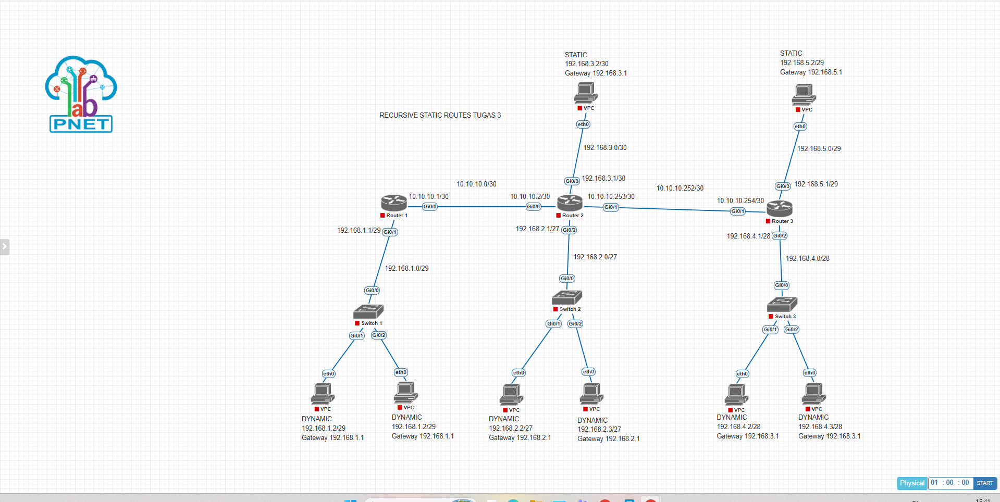

# Proyek 3: Skenario Recursive Static Routing Tingkat Lanjut
### Optimasi Jalur Forwarding Lintas Multi-Hop Gateway via Cisco IOSv

## 1. Deskripsi Proyek
Proyek ini mendemonstrasikan implementasi dan analisis perilaku Recursive Static Routing di lingkungan jaringan hibrida. Skenario lab ini mengeksplorasi bagaimana perangkat Cisco router melakukan pencarian rute ganda (double lookup) di dalam Routing Information Base (RIB) untuk menentukan interface keluar (exit interface) berdasarkan kecocokan alamat IP tujuan berikutnya (next-hop). Desain lab ini memisahkan segmen pengguna ke dalam alokasi alamat IP dinamis (DHCP Client) dan alokasi alamat IP statis untuk menguji efisiensi penerusan paket data jarak jauh.

---

## 2. Topologi Jaringan & Alokasi Interface

### • Komponen Infrastruktur Jaringan
*   **Router 1:** Bertindak sebagai router tepi segmen kiri jaringan internal.
*   **Router 2:** Router inti penengah (Forwarding Core) yang menghubungkan seluruh segmen LAN.
*   **Router 3:** Bertindak sebagai router tepi segmen kanan jaringan internal.
*   **End-User Client:** Terbagi menjadi segmen klien beralokasi IP Dinamis (DHCP) pada layer bawah dan segmen khusus IP Statis pada layer atas.

### • Dokumentasi Topologi Jaringan
Berikut adalah rancangan topologi multi-hop routing yang diimplementasikan pada simulator PNetLab:


### • Tabel Pengalamatan IP & Skema Jaringan (IP Addressing Table)

| Perangkat (Node) | Interface | IP Address / Netmask | Gateway / Next-Hop | Deskripsi / Peruntukan Segmen |
| :--- | :--- | :--- | :--- | :--- |
| **Router 1** | `Gi0/0` | `10.10.10.1/30` | Direct | Interkoneksi Link ke Router 2 |
| | `Gi0/1` | `192.168.1.1/29` | Direct | Gateway Segmen Klien DYNAMIC (Kiri) |
| **Router 2** | `Gi0/0` | `10.10.10.2/30` | Direct | Interkoneksi Link ke Router 1 |
| | `Gi0/1` | `10.10.10.253/30` | Direct | Interkoneksi Link ke Router 3 |
| | `Gi0/2` | `192.168.2.1/27` | Direct | Gateway Segmen Klien DYNAMIC (Tengah) |
| | `Gi0/3` | `192.168.3.1/30` | Direct | Gateway Segmen Klien STATIC (Tengah) |
| **Router 3** | `Gi0/1` | `10.10.10.254/30` | Direct | Interkoneksi Link ke Router 2 |
| | `Gi0/2` | `192.168.4.1/28` | Direct | Gateway Segmen Klien DYNAMIC (Kanan) |
| | `Gi0/3` | `192.168.5.1/29` | Direct | Gateway Segmen Klien STATIC (Kanan) |
| **VPC Klien (Atas)**| `eth0` (Kiri) | `192.168.3.2/30` | `192.168.3.1` | Klien khusus berstatus STATIC |
| | `eth0` (Kanan)| `192.168.5.2/29` | `192.168.5.1` | Klien khusus berstatus STATIC |

---

## 3. Cetak Biru Konfigurasi Utama (Core CLI Script)

Konfigurasi rute statis hibrida dipusatkan pada **Router 2** untuk memastikan keterjangkauan paket data (reachability) ke seluruh ujung jaringan internal:

```text
!
hostname Router2
!
interface GigabitEthernet0/0
 ip address 10.10.10.2 255.255.255.252
!
interface GigabitEthernet0/1
 ip address 10.10.10.253 255.255.255.252
!
interface GigabitEthernet0/2
 ip address 192.168.2.1 255.255.255.224
!
interface GigabitEthernet0/3
 ip address 192.168.3.1 255.255.255.252
!
ip route 192.168.1.0 255.255.255.248 10.10.10.1
ip route 192.168.4.0 255.255.255.240 10.10.10.254
ip route 192.168.5.0 255.255.255.248 10.10.10.254
!
```

---

## 4. Analisis Teknik & Mekanisme Forwarding Rekursif

1.  **Mekanisme Double RIB Lookup:** Ketika Router 2 menerima paket menuju segmen LAN ujung luar (misalnya `192.168.5.0/28`), router pertama kali memeriksa tabel RIB untuk mencocokkan rute statis. Router menemukan rute statis menunjuk ke IP *next-hop* `10.10.10.254`. Router kemudian melakukan *lookup* kedua (rekursif) untuk menemukan interkoneksi fisik mana yang terhubung ke IP `10.10.10.254`, dan menentukan bahwa paket harus keluar melalui interface `GigabitEthernet0/1`.
2.  **Keuntungan Arsitektur Jaringan:** Penggunaan rute rekursif meminimalkan kebutuhan administrasi manual apabila interface fisik berubah, selama IP rute penengah (*next-hop*) tetap dapat dijangkau di dalam tabel *routing*.

---

## 5. Verifikasi Akhir & Status Konektivitas (Reachability Test)
Seluruh rute statis antar segmen multi-hop pada lab ini telah tervalidasi dengan status operasional penuh:
*   Klien segmen internal `DYNAMIC` di sisi kiri bawah dapat melakukan komunikasi data secara lancar menuju klien segmen `STATIC` di sisi kanan atas.
*   Hasil pengujian perintah ICMP (Ping) dari seluruh VPC Klien menuju alamat IP *Gateway* masing-masing maupun lintas router tepi membuktikan status sukses penuh (0% packet loss).

---

## 6. Prasyarat Simulator & Spesifikasi Image
Berkas topologi mentah simulator (`Tugas  Recursive Static Routes 3.unl`) telah disediakan di dalam repositori ini. Untuk kebutuhan replikasi lab, pastikan PNetLab Anda telah menginstal *image* berikut:

*   **Routing Nodes:** `vios-adventerprisek9-m.spa.159-3.m9` (Cisco IOSv L3)
*   **Switching Nodes:** `viosl2-adventerprisek9-m.ssa.high_iron_20200929` (Cisco IOSv L2)
*   **Host Clients:** VPCS (Virtual PC Simulator)
