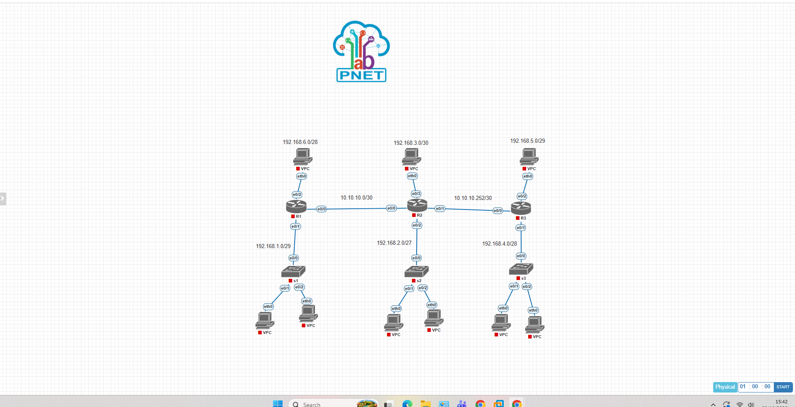

# Proyek 4: Implementasi Arsitektur Enterprise OSPF Area 0
### Skalabilitas Forwarding dan Interkoneksi Heterogen LAN Korporat via Cisco IOL

## 1. Deskripsi Proyek
Proyek ini mendemonstrasikan rancangan dan implementasi protokol routing dinamis Open Shortest Path First (OSPF) Single-Area yang difokuskan pada Area 0 (Backbone Area). Lab ini menyimulasikan jaringan korporasi heterogen skala menengah yang menghubungkan tiga lokasi router utama (R1, R2, dan R3) melewati interkoneksi link Point-to-Point /30. Desain infrastruktur ini ditujukan untuk menguji kecepatan konvergensi, penanganan tabel Link-State Advertisement (LSA), serta efisiensi segmentasi subnet mask (VLSM) yang didistribusikan secara otomatis melalui fitur DHCP Server internal router.

---

## 2. Topologi Jaringan & Alokasi Interface

### • Komponen Infrastruktur Jaringan
*   **Router R1:** Mengelola jaringan LAN wilayah barat termasuk segmen dinamis /29 dan segmen khusus /28.
*   **Router R2:** Router pusat penengah sekaligus bertindak sebagai Anchor Forwarding Backbone yang memegang segmen LAN /27 dan /30.
*   **Router R3:** Mengelola jaringan LAN wilayah timur termasuk segmen dinamis /28 dan segmen khusus /29.
*   **Switch S1, S2, S3:** Bertindak sebagai infrastruktur distribusi Layer 2 untuk memecah akses menuju end-user VPC di masing-masing area.

### • Dokumentasi Topologi Jaringan
Berikut adalah rancangan topologi Enterprise OSPF Backbone Area 0 yang diimplementasikan pada simulator PNetLab:


### • Tabel Pengalamatan IP & Skema Wilayah Jaringan (IP Addressing Table)

| Perangkat (Node) | Interface | IP Address / Netmask | OSPF Area | Keterangan / Peruntukan Segmen |
| :--- | :--- | :--- | :--- | :--- |
| **R1** | `e0/0` | `10.10.10.1/30` | Area 0 | Interkoneksi Backbone Link ke R2 |
| | `e0/1` | `192.168.1.1/29` | Area 0 | Gateway LAN S1 (Segmen Bawah) |
| | `e0/2` | `192.168.6.1/28` | Area 0 | Gateway LAN Atas (VPC 6) |
| **R2** | `e0/0` | `10.10.10.2/30` | Area 0 | Interkoneksi Backbone Link ke R1 |
| | `e0/1` | `10.10.10.253/30` | Area 0 | Interkoneksi Backbone Link ke R3 |
| | `e0/2` | `192.168.2.1/27` | Area 0 | Gateway LAN S2 (Segmen Bawah) |
| | `e0/3` | `192.168.3.1/30` | Area 0 | Gateway LAN Atas (VPC 3) |
| **R3** | `e0/0` | `10.10.10.254/30` | Area 0 | Interkoneksi Backbone Link ke R2 |
| | `e0/1` | `192.168.4.1/28` | Area 0 | Gateway LAN S3 (Segmen Bawah) |
| | `e0/2` | `192.168.5.1/29` | Area 0 | Gateway LAN Atas (VPC 5) |

---

## 3. Cetak Biru Konfigurasi Utama (Core CLI Script)

Konfigurasi routing OSPF Area 0 didistribusikan secara penuh pada seluruh router. Berikut adalah skrip inti parameter routing dinamis yang diimplementasikan pada **R1** dan **R2**:

**Sisi Router R1:**
```text
!
hostname R1
!
interface Ethernet0/0
 ip address 10.10.10.1 255.255.255.252
!
interface Ethernet0/1
 ip address 192.168.1.1 255.255.255.248
!
interface Ethernet0/2
 ip address 192.168.6.1 255.255.255.240
!
router ospf 1
 network 10.10.10.0 0.0.0.3 area 0
 network 192.168.1.0 0.0.0.7 area 0
 network 192.168.6.0 0.0.0.15 area 0
!
```

**Sisi Router R2 (Core Anchor):**
```text
!
hostname R2
!
interface Ethernet0/0
 ip address 10.10.10.2 255.255.255.252
!
interface Ethernet0/1
 ip address 10.10.10.253 255.255.255.252
!
interface Ethernet0/2
 ip address 192.168.2.1 255.255.255.224
!
interface Ethernet0/3
 ip address 192.168.3.1 255.255.255.252
!
router ospf 1
 network 10.10.10.0 0.0.0.3 area 0
 network 10.10.10.252 0.0.0.3 area 0
 network 192.168.2.0 0.0.0.31 area 0
 network 192.168.3.0 0.0.0.3 area 0
!
```

---

## 4. Analisis Teknik & Mekanisme Adjacency OSPF

1.  **Pembentukan OSPF Neighbor Adjacency:** Setelah perintah `network` diaktifkan menggunakan parameter Wildcard Mask yang presisi, proses Hello Packet langsung dikirimkan melalui multicast address `224.0.0.5`. Langkah ini berhasil membawa status hubungan antar router melewati fase Init, Two-Way, ExStart, Exchange, Loading, hingga mencapai konvergensi penuh pada status **FULL/DR** atau **FULL/BDR** di segmen multi-access.
2.  **Efisiensi Distribusi VLSM:** Penggunaan protokol link-state OSPF memungkinkan pengiriman informasi subnet mask yang bervariasi secara classless. Hal ini menjamin rute spesifik seperti jaringan dinamis `/27` milik R2 dapat dikenali dengan tepat oleh R1 dan R3 tanpa mengalami fenomena overlapping IP atau summarization otomatis yang merusak tabel rute.

---

## 5. Verifikasi Akhir & Status Konektivitas (Reachability Test)
Dengan tercapainya status konvergensi penuh (FULL State) pada seluruh OSPF node, stabilitas jalur forwarding data terbukti andal:
*   Tabel routing pada tiap-masing perangkat telah sukses memetakan rute internal dengan kode rute **O** untuk seluruh network eksternal yang diiklankan oleh router tetangga.
*   Seluruh end-user VPC yang mendapatkan IP address dinamis dari DHCP server internal router terbukti sukses melakukan pengujian komunikasi data (ICMP Ping) lintas wilayah backbone dengan hasil **sukses penuh (0% packet loss)**.

---

## 6. Prasyarat Simulator & Spesifikasi Image
Berkas topologi mentah simulator (`Tugas OSPF 2.unl`) telah disediakan di dalam repositori ini. Untuk kebutuhan replikasi lab, pastikan PNetLab Anda telah menginstal *image* perangkat heterogen berikut:

*   **Routing Nodes (L3):** i86bi-linux-l3-adventerprisek9-m2_157_3_may_2018.bin (Cisco IOL L3)
*   **Switching Nodes (L2):** i86bi_linux-l2-adventerprisek9-ms.bin (Cisco IOL L2)
*   **Host Clients:** VPCS (Virtual PC Simulator)
