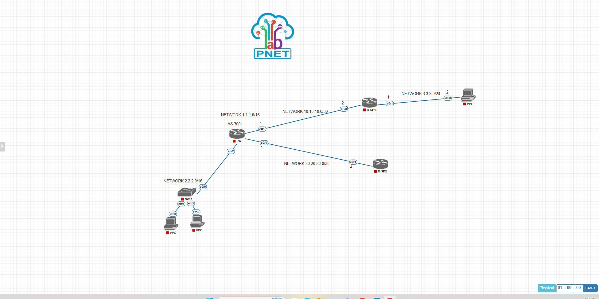

# Proyek 5: Implementasi Eksplorasi External BGP (eBGP) Multi-AS
### Kebijakan Interdomain Routing Skala Service Provider via Cisco IOL

## 1. Deskripsi Proyek
Proyek ini mendemonstrasikan perancangan dan implementasi protokol routing dinamis External BGP (eBGP) untuk menghubungkan tiga Autonomous System (AS) yang berbeda secara hibrida. Lab ini menyimulasikan skenario dunia nyata di mana sebuah jaringan Enterprise Edge (AS 300) terhubung secara redundan menuju dua Service Provider berbeda, yaitu AS 100 (R SP1) dan AS 200 (R SP2). Fokus pengujian lab ini mencakup pembentukan hubungan ketetanggaan (BGP Neighbor Adjacency) lintas batas administratif AS, validasi tabel BGP (RIB-In/RIB-Out), serta pengumuman prefiks (Network Advertisement) antar-domain.

---

## 2. Topologi Jaringan & Alokasi Interface

### • Spesifikasi Autonomous System (AS)
*   **AS 300 (Enterprise Boundary):** Dikelola oleh Router RA sebagai jangkar utama yang memegang segmen LAN internal korporat.
*   **AS 100 (Service Provider 1):** Dikelola oleh Router R SP1 yang mengalirkan interkoneksi transit.
*   **AS 200 (Service Provider 2):** Dikelola oleh Router R SP2 sebagai jalur transit alternatif.

### • Dokumentasi Topologi Jaringan
Berikut adalah rancangan topologi eBGP Multi-AS yang diimplementasikan pada simulator PNetLab:


### • Tabel Pengalamatan IP & Skema Wilayah Jaringan (IP Addressing Table)

| Perangkat (Node) | Interface | IP Address / Netmask | Autonomous System (AS) | Keterangan / Peruntukan Segmen |
| :--- | :--- | :--- | :--- | :--- |
| **RA** | `e0/0` | `10.10.10.1/30` | AS 300 | eBGP Peer Link menuju R SP1 (AS 100) |
| | `e0/1` | `20.20.20.1/30` | AS 300 | eBGP Peer Link menuju R SP2 (AS 200) |
| | `e0/2` | `2.2.0.1/16` | AS 300 | Gateway LAN Internal (SW 1) |
| **R SP1** | `e0/0` | `10.10.10.2/30` | AS 100 | eBGP Peer Link menuju RA (AS 300) |
| | `e0/1` | `3.3.3.1/24` | AS 100 | Gateway LAN Eksternal (VPC 7) |
| **R SP2** | `e0/1` | `20.20.20.2/30` | AS 200 | eBGP Peer Link menuju RA (AS 300) |

---

## 3. Cetak Biru Konfigurasi Utama (Core CLI Script)

Konfigurasi routing eBGP dikonfigurasi secara manual pada titik perbatasan interdomain. Berikut adalah skrip konfigurasi parameter eBGP utama yang aktif pada RA dan R SP1:

**Sisi Router RA (Enterprise Boundary):**
```text
!
hostname RA
!
interface Ethernet0/0
 ip address 10.10.10.1 255.255.255.252
!
interface Ethernet0/1
 ip address 20.20.20.1 255.255.255.252
!
interface Ethernet0/2
 ip address 2.2.0.1 255.255.0.0
!
router bgp 300
 bgp log-neighbor-changes
 network 1.1.0.0 mask 255.255.0.0
 network 2.2.0.0 mask 255.255.0.0
 network 10.10.10.0 mask 255.255.255.252
 network 20.20.20.0 mask 255.255.255.252
 neighbor 10.10.10.2 remote-as 100
 neighbor 20.20.20.2 remote-as 200
!
```

**Sisi Router R SP1 (Service Provider 1):**
```text
!
hostname R_SP1
!
interface Ethernet0/0
 ip address 10.10.10.2 255.255.255.252
!
interface Ethernet0/1
 ip address 3.3.3.1 255.255.255.0
!
router bgp 100
 bgp log-neighbor-changes
 network 3.3.3.0 mask 255.255.255.0
 neighbor 10.10.10.1 remote-as 300
!
```

---

## 4. Analisis Teknik & Mekanisme Konvergensi eBGP

1.  **Pembentukan eBGP Session Adjacency:** Berbeda dengan protokol IGP yang mengandalkan penemuan tetangga otomatis melalui multicast, eBGP membutuhkan definisi peer manual menggunakan perintah `neighbor`. Sesi jabat tangan TCP pada port 179 diinisialisasi oleh Router RA untuk melewati fase OpenSent dan OpenConfirm hingga mencapai status stabil **Established** dengan R SP1 dan R SP2.
2.  **Sifat Desentralisasi Jalur (As-Path Attribute):** Prefiks internal milik korporat (`2.2.0.0/16`) diumumkan secara sah melalui statemen `network`. Saat prefiks ini menyeberang ke AS 100, informasi rute akan disisipi oleh *AS-Path Attribute* penanda asal rute. Protokol BGP menjamin rute eksternal dari Service Provider tidak akan mengalami *looping* karena adanya validasi jika sebuah router melihat nomor AS-nya sendiri di dalam atribut jalur paket yang diterima.

---

## 5. Verifikasi Akhir & Status Konektivitas (Reachability Test)
Keberhasilan konvergensi tabel eBGP global dibuktikan melalui indikator fungsional berikut:
*   Eksekusi perintah `show ip bgp summary` menunjukkan sesi peer berstatus aktif dengan indikator penerimaan jumlah prefiks (State/PfxRcd) dalam bentuk angka numerik valid.
*   Tabel rute pada Router R SP1 berhasil mempelajari segmen network `2.2.0.0/16` bertanda kode **B (BGP)**.
*   Pengujian ICMP (Ping) dari PC klien eksternal (AS 100) menuju segmen LAN internal Enterprise (AS 300) tervalidasi **sukses penuh (0% packet loss)**.

---

## 6. Prasyarat Simulator & Spesifikasi Image
Berkas topologi mentah simulator (`Tugas Routing BGP.unl`) telah disediakan di dalam repositori ini. Untuk kebutuhan replikasi lab, pastikan PNetLab Anda telah menginstal *image* berikut:

*   **Routing Nodes (L3):** i86bi-linux-l3-adventerprisek9-m2_157_3_may_2018.bin (Cisco IOL L3)
*   **Switching Nodes (L2):** i86bi_linux-l2-adventerprisek9-ms.bin (Cisco IOL L2)
*   **Host Clients:** VPCS (Virtual PC Simulator)
