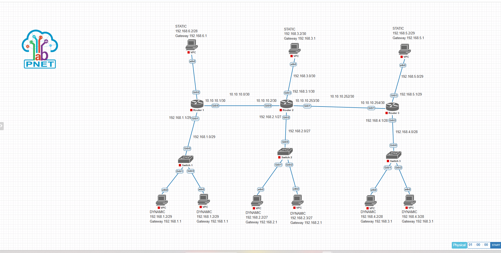

# Proyek 6: Implementasi Dinamis RIPv2 dengan Optimasi Classless Subnetting
### Manajemen Konvergensi Interior Gateway Protocol (IGP) via Cisco vIOSv

## 1. Deskripsi Proyek
Proyek ini mendemonstrasikan implementasi dan evaluasi perilaku protokol routing dinamis RIP Version 2 (RIPv2) di dalam infrastruktur jaringan multi-area perusahaan. Skenario lab ini difokuskan pada pengujian kapabilitas RIPv2 dalam mendistribusikan pembaruan tabel routing (Routing Updates) secara classless menggunakan subnet mask yang bervariasi (VLSM). Konfigurasi ini juga menerapkan penonaktifan fitur summarization otomatis guna memastikan rute spesifik segmen LAN /27, /28, dan /29 dapat terpetakan dengan akurat di seluruh node tanpa mengalami diskoneksi akibat overlapping network pada perbatasan major network.

---

## 2. Topologi Jaringan & Alokasi Interface

### • Spesifikasi Arsitektur Dynamic Routing
*   **Router 1:** Mengelola iklan rute LAN wilayah kiri untuk network dinamis /29.
*   **Router 2:** Bertindak sebagai Anchor Routing Core yang menjembatani pertukaran tabel RIPv2 untuk segmen internal /27 dan /30.
*   **Router 3:** Mengelola iklan rute LAN wilayah kanan untuk network dinamis /28 dan /29.

### • Dokumentasi Topologi Jaringan
Berikut adalah rancangan topologi dinamis RIPv2 hibrida yang diimplementasikan pada simulator PNetLab:


### • Tabel Pengalamatan IP & Skema Wilayah Jaringan (IP Addressing Table)

| Perangkat (Node) | Interface | IP Address / Netmask | Protokol Routing | Keterangan / Peruntukan Segmen |
| :--- | :--- | :--- | :--- | :--- |
| **Router 1** | `Gi0/0` | `10.10.10.1/30` | RIPv2 | Jalur Interkoneksi Utama ke Router 2 |
| | `Gi0/1` | `192.168.1.1/29` | RIPv2 | Gateway LAN Klien Dynamic (Kiri) |
| **Router 2** | `Gi0/0` | `10.10.10.2/30` | RIPv2 | Jalur Interkoneksi Utama ke Router 1 |
| | `Gi0/1` | `10.10.10.253/30` | RIPv2 | Jalur Interkoneksi Utama ke Router 3 |
| | `Gi0/2` | `192.168.2.1/27` | RIPv2 | Gateway LAN Klien Dynamic (Tengah) |
| | `Gi0/3` | `192.168.3.1/30` | RIPv2 | Gateway LAN Klien Static (Tengah) |
| **Router 3** | `Gi0/1` | `10.10.10.254/30` | RIPv2 | Jalur Interkoneksi Utama ke Router 2 |
| | `Gi0/2` | `192.168.4.1/28` | RIPv2 | Gateway LAN Klien Dynamic (Kanan) |
| | `Gi0/3` | `192.168.5.1/29` | RIPv2 | Gateway LAN Klien Static (Kanan) |

---

## 3. Cetak Biru Konfigurasi Utama (Core CLI Script)

Parameter utama keberhasilan konvergensi terdistribusi dipusatkan pada aktivasi versi protokol dan komando eliminasi summarization otomatis pada **Router 1** dan **Router 2**:

**Sisi Router 1:**
```text
!
hostname Router1
!
interface GigabitEthernet0/0
 ip address 10.10.10.1 255.255.255.252
!
interface GigabitEthernet0/1
 ip address 192.168.1.1 255.255.255.248
!
router rip
 version 2
 network 10.0.0.0
 network 192.168.1.0
 no auto-summary
!
```

**Sisi Router 2 (Anchor Core):**
```text
!
hostname Router2
!
interface GigabitEthernet0/0
 ip address 10.10.10.2 255.255.255.252
!
interface GigabitEthernet0/1
 ip address 10.10.10.253 255.255.255.252
!
interface GigabitEthernet0/2
 ip address 192.168.2.1 255.255.255.224
!
interface GigabitEthernet0/3
 ip address 192.168.3.1 255.255.255.252
!
router rip
 version 2
 network 10.0.0.0
 network 192.168.2.0
 network 192.168.3.0
 no auto-summary
!
```

---

## 4. Analisis Teknik & Penanganan Isu Auto-Summary

1.  **Aktivasi Argumen No Auto-Summary:** Karakteristik bawaan protokol RIP bersifat classful, di mana router akan merangkum otomatis rute subnetted menjadi rute kelas penuh (major network boundary) saat dikirim melintasi network penengah yang berbeda. Perintah `no auto-summary` wajib diaktifkan pada skrip agar router mengirimkan pembaruan routing beserta informasi subnet mask aslinya. Hal ini mencegah kegagalan pengiriman paket data akibat informasi rute ganda yang salah terakumulasi sebagai network kelas penuh `192.168.0.0/16`.
2.  **Mekanisme Split Horizon:** Perangkat mengadopsi aturan penangkalan loop split horizon secara otomatis pada interface fisik guna mencegah sebuah rute diiklankan kembali ke arah interface asal rute tersebut dipelajari, menjaga stabilitas database routing internal dari ancaman loop fungsional.

---

## 5. Verifikasi Akhir & Status Konektivitas (Reachability Test)
Stabilitas pemetaan rute dinamis berbasis jarak hop (Hop-Count) telah tervalidasi dengan hasil operasional berikut:
*   Tabel rute pada masing-masing edge router sukses memuat informasi network tujuan jarak jauh bertanda kode routing **R (RIP)** dengan batasan fungsional maksimal hingga 15 hop.
*   Seluruh pengujian interkoneksi end-to-end melalui perintah ICMP (Ping) dari VPC klien dinamis maupun statis menuju target gateway terjauh tervalidasi **sukses penuh (0% packet loss)**.

---

## 6. Prasyarat Simulator & Spesifikasi Image
Berkas topologi mentah simulator (`Tugas Routing RIP.unl`) telah disediakan di dalam repositori ini. Untuk kebutuhan replikasi lab, pastikan PNetLab Anda telah menginstal *image* berikut:

*   **Routing Nodes:** vios-adventerprisek9-m.spa.159-3.m9 (Cisco IOSv L3)
*   **Switching Nodes:** viosl2-adventerprisek9-m.ssa.high_iron_20200929 (Cisco IOSv L2)
*   **Host Clients:** VPCS (Virtual PC Simulator)
